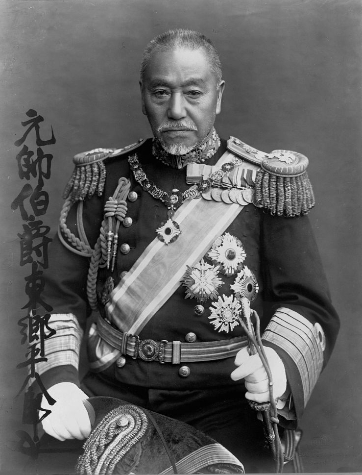

# 小个子海军大将，一战成就东方纳尔逊

话说明治时代，日本人最爱学英国，学什么都要学个彻底。学制度，学技术，连海军都要学得像模像样。可您要问我，谁是日本海军史上最牛的人物？那答案只有一个——、东乡平八郎、。

这位仁兄，身高不到一米六，在日本人里头都算矮的，可就是这么个小个子，硬生生把沙皇俄国的波罗的海舰队给收拾得片甲不留。英国人都说他是"东方纳尔逊"，这评价可不是随便给的。

咱们今儿就来细细道来这位、东乡平八郎、，看看一个萨摩穷武士的儿子，是怎么成为威震四海的海军大将的。

---

## 萨摩出身，英国深造

、东乡平八郎、这人，1848年出生在萨摩藩，也就是现在的鹿儿岛。他爹是个下级武士，家里穷得叮当响，按理说这辈子也就是个小角色。可偏偏赶上了明治维新这趟车。

萨摩藩有个传统，就是敢闯敢拼。、岛津齐彬、当藩主的时候，就开始搞洋务运动了。1863年，萨英战争打完，萨摩人发现英国的舰炮确实厉害，于是痛定思痛，要派人到英国学海军。

您猜猜，选中了谁？就是这个当时才15岁的、东乡平八郎、。

1871年，23岁的、东乡平八郎、跟着岩仓使节团到了英国。在朴次茅斯海军学校待了七年，把英国海军的那套东西学了个遍。这七年可不是白混的，英国海军什么传统，什么规矩，什么战术，他都一一学到手了。

更重要的是，他学会了一样东西——冷静。英国海军有句话叫"Keep calm and carry on"，翻译过来就是"保持冷静，继续前进"。这话后来成了、东乡平八郎、的座右铭。

---

## 从中队长到舰队司令

回到日本后，、东乡平八郎、从一个小小的中队长干起。甲午战争的时候，他指挥的"浪速"号巡洋舰，在黄海海战中表现出色。可那时候，谁也没把他当回事儿，毕竟海军的头把交椅坐着、伊东祐亨、呢。

1904年，日俄战争爆发，这时候的、东乡平八郎、已经56岁了。按理说，这个年纪早该退休养老了。可偏偏就在这关键时刻，明治天皇和军部做了个惊人的决定——让、东乡平八郎、出任联合舰队司令长官。

您想想，这是要跟沙皇俄国的海军硬碰硬啊！俄国可是传统的海军强国，波罗的海舰队从彼得大帝时代就有了，那家底儿厚着呢。日本海军虽然学了几十年，可到底还是个后起之秀。

可、东乡平八郎、这人有个特点——越是关键时刻，越是冷静。他知道，这一仗如果败了，日本的国运就完了。

---

## 旅顺封锁战，消耗战的艺术

接到任务后，、东乡平八郎、做的第一件事，就是封锁旅顺港。俄国太平洋舰队的主力都窝在那儿呢，不把它们困住，后患无穷。

这一封锁就是八个月。您别小看这种消耗战，这里头学问大了。不是简单的围着不让走，而是要让对方天天提心吊胆，士气一点一点地消磨干净。

俄国人憋不住了，几次想冲出来决战，都被、东乡平八郎、给挡了回去。他的战术很简单：不求全胜，但求不败。先把对方的锐气磨光，再说别的。

这招儿跟当年、德川家康、在关原之战前的策略如出一辙——不着急，耗得起，最后笑的才是赢家。

---

## 对马海峡，一战定乾坤

1905年5月，沙皇终于坐不住了，派出波罗的海舰队，绕道半个地球，要来跟日本决一死战。这支舰队的司令官叫、罗泽斯特文斯基、，也是个硬角色，在俄国海军里头声名赫赫。

5月27日清晨，对马海峡。两支舰队终于碰面了。

这一战，后来被称为"日本海大海战"，也有人叫"对马海战"。反正怎么叫都行，总之这一仗打出了日本海军的威名。

、东乡平八郎、采用的战术叫"丁字战法"——用自己舰队的侧舷，对准敌人舰队的头部，形成一个"丁"字形。这样一来，日舰的所有火炮都能瞄准俄舰，而俄舰只有前面几艘船能开火。

这招儿说起来简单，做起来可不容易。时机掌握不好，自己就先被打散了。可、东乡平八郎、就是有这个本事，在最合适的时间，最合适的位置，完成了这个经典的战术动作。

战斗从早上打到傍晚，俄国舰队全军覆没。38艘战舰，沉了21艘，被俘6艘，逃到中立港的5艘，真正跑掉的只有6艘小船。、罗泽斯特文斯基、本人也当了俘虏。

、东乡平八郎、创造了海战史上的奇迹——以微小的代价（3艘鱼雷艇），几乎全歼敌方主力舰队。

---

## 英雄的黄昏

对马海战之后，、东乡平八郎、成了日本的民族英雄。天皇册封他为元帅，全国上下都把他当神一样供着。连英国人都服气了，说他是"东方的纳尔逊"。

可您知道吗？成名之后的、东乡平八郎、，反而变得更加低调了。他很清楚，这一仗的胜利，靠的不只是他一个人的指挥才能，而是整个日本海军多年来的积累，是无数人努力的结果。

1913年，65岁的、东乡平八郎、正式退休。退休后的他，没有沉浸在荣誉中不可自拔，而是继续关心海军建设，培养后进。一直到1934年去世，享年86岁。

有意思的是，这位海军英雄晚年最爱做的事情，就是写毛笔字。他写得最多的两个字，就是"平常心"。

---

## 小个子的大智慧

回过头来看，、东乡平八郎、为什么能成功？

首先，他有技术。在英国海军学校待了七年，把人家的精髓学到了手。技术这东西，容不得半点马虎。

其次，他有心理素质。越是关键时刻，越是冷静。这一点，比什么都重要。指挥官一慌，全军都得跟着乱套。

最后，也是最关键的一点——他懂得什么时候该冒险，什么时候该保守。旅顺封锁战的时候保守，对马海战的时候冒险，这个分寸掌握得恰到好处。

说到底，战争打的不只是装备，打的更是人的智慧。、东乡平八郎、这个小个子，用他的大智慧，为日本赢得了一个时代。

当然，历史这东西复杂得很。日俄战争的胜利，给日本带来了荣耀，也埋下了后来军国主义的种子。、东乡平八郎、本人倒是始终保持着武士的品格，可他的后辈们，就没那么清醒了。

不过这些都是后话了。单就、东乡平八郎、这个人来说，他确实配得上"东方纳尔逊"这个称号。一个萨摩穷武士的儿子，靠着自己的努力和天赋，成为了威震四海的海军名将。

您说这故事，是不是比小说还精彩？

---

*话说英雄，各有各的成名路。有人靠运气，有人靠关系，可真正能留名青史的，靠的还是实力。、东乡平八郎、就是这样的人——平时不起眼，关键时刻顶得住。您琢磨琢磨，这样的人，是不是最可怕的对手？*