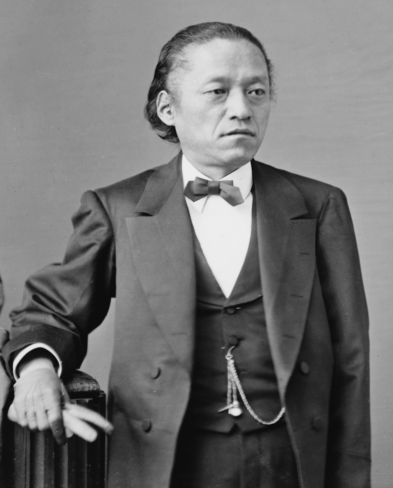

# 岩仓具视：从攘夷公卿到开国推手的华丽转身

话说、明治维新、这场大戏里头，有个人特别有意思——、岩仓具视、。

怎么个有意思法呢？您想想看，这位老兄一开始是坚决反对开国的攘夷派公卿，恨不得把外国人全赶出日本。可到了最后，他却成了明治政府派遣到欧美学习西方文明的使节团团长。这转弯转得，那叫一个华丽！

这就好比一个天天骂洋人的老古董，突然有一天穿着西装，带着一大帮人去欧洲考察学习。您说这事情有多神奇？

---

## 出身：公卿世家的边缘人物

、岩仓具视、生于文政八年（1825年），出身堂上家岩仓家。这堂上家是什么概念？就是世代在朝廷当官的贵族家庭，地位比一般的公卿要低一些，但好歹也算是京都的上流社会。

可这位岩仓家的少爷，从小就不是个安分的主儿。他性格倔强，说话直来直去，在那个讲究含蓄和礼数的公卿圈子里，显得有些格格不入。用现在的话说，就是不太会做人。

但是，正是这种不合群的性格，让他在后来的政治风暴中展现出了惊人的韧性和应变能力。毕竟，在那个朝令夕改的年代里，太圆滑的人往往站不住脚，反倒是这种有点轴的人，更容易坚持到最后。

年轻时的、岩仓具视、在朝廷里只是个小官，但他有个特点——喜欢学习，尤其是对政治和外交特别感兴趣。这在当时的公卿圈子里是很少见的，大部分贵族子弟只会诗歌和仪式，对国家大事漠不关心。

---

## 攘夷时代：坚定的守旧派

到了幕末时期，外国势力开始叩关，整个日本都被卷入了开国还是锁国的大辩论中。这时候的、岩仓具视、毫不犹豫地站在了攘夷派这一边。

他的逻辑很简单：日本是神国，天皇是神的后代，怎么能让蛮夷玷污这片神圣的土地？必须把外国人赶出去，维护日本的纯洁性！

安政五年（1858年），当幕府签订《安政五国条约》的时候，、岩仓具视、气得够呛。他联合其他公卿，不断给孝明天皇进言，要求拒绝条约，驱逐外夷。

您想想看，这位老兄当时有多激进？他甚至参与策划了针对开国派的政治斗争，想方设法要把支持开国的幕府大老井伊直弼拉下马。

文久二年（1862年），、岩仓具视、还参与了、公武合体、运动，主张让天皇和幕府联合起来，共同对付外国势力。这时候的他，完全就是一个标准的、尊王攘夷、派。

但是，政治这东西就是这样，风向变得比六月的天还快。、岩仓具视、很快就发现，光喊攘夷口号是没用的，关键还得看实力。而现实是什么呢？日本根本打不过西方列强！

---

## 政治失意：被逐出京都的日子

文久三年（1863年），政局突变。萨摩藩和会津藩联手发动政变，把长州藩和激进的攘夷派公卿全部赶出了京都。、岩仓具视、也在被清洗之列，被迫离开朝廷，隐居在京都郊外的岩仓村。

这一隐居就是五年！对于一个政治动物来说，这五年的蛰伏期是相当痛苦的。但是，也正是这五年的沉寂，让、岩仓具视、有了深入思考的机会。

在岩仓村的日子里，他没有闲着，而是通过各种渠道了解国际形势，研究西方文明。他逐渐意识到，攘夷是不现实的，日本要想生存下去，必须学习西方的先进技术和制度。

这种思想转变，用现在的话说就是"与时俱进"。当你发现旧的思路走不通的时候，就得换一条路。、岩仓具视、的高明之处就在于，他能够放下面子，承认自己以前的观点是错误的。

慶應三年（1867年），随着政局的再次变化，、岩仓具视、被召回京都。这时候的他，已经从一个激进的攘夷派，悄悄转变成了一个务实的改革派。

---

## 倒幕先锋：从攘夷到倒幕的华丽转身

回到京都的、岩仓具视、，面对的是一个全新的政治格局。萨摩藩和长州藩已经结成了、萨长同盟、，准备推翻德川幕府。而、岩仓具视、凭借自己在朝廷中的影响力，成了倒幕派的重要盟友。

这个转变其实并不奇怪。对于、岩仓具视、来说，攘夷的目标没有变，变的只是手段。他意识到，要想真正实现攘夷（或者说维护日本的独立），首先得有一个强有力的政府。而德川幕府显然已经腐朽了，不堪大任。

慶應三年十二月，、岩仓具视、参与策划了、王政复古、大号令，宣布废除幕府，建立以天皇为首的新政府。这一招可以说是釜底抽薪，直接从法理上否定了德川幕府的统治合法性。

但是，光有法理还不够，还得有实力支撑。接下来的、戊辰战争、中，、岩仓具视、虽然不上战场，但在政治层面发挥了重要作用。他帮助新政府争取到了各藩的支持，稳定了后方。

---

## 政治家的成熟：实用主义的胜利

明治新政府成立后，、岩仓具视、被任命为副总裁，后来又担任右大臣，成为新政府的核心人物。这时候的他，已经完全褪去了早期那种书生意气，变成了一个成熟的政治家。

他的政治理念也发生了根本性的转变。早期的攘夷思想，现在变成了"富国强兵"和"文明开化"。他认为，要想让日本真正强大起来，必须全面学习西方文明，从技术到制度，全盘吸收。

这种转变，在当时是需要巨大勇气的。毕竟，他曾经是攘夷派的代表人物，现在却要主张学习西方，这无异于自己打自己的脸。但是，、岩仓具视、就是有这种魄力，敢于承认错误，敢于改变。

明治四年（1871年），新政府面临一个重大决策：要不要派遣大规模的使节团到欧美学习？这个提议一出来，朝野上下争论激烈。支持者认为这是学习先进文明的好机会，反对者则担心这时候让西方列强小看日本。

关键时刻，、岩仓具视、站了出来。他不仅支持派遣使节团，还主动请缨担任团长。您想想看，这需要多大的勇气？一个曾经的攘夷派领袖，现在要带头去"敌人"的老家学习，这在当时是多么大的政治风险！

---

## 岩仓使节团：改变日本的伟大征程

明治四年十一月十二日，岩仓使节团正式启程。这个使节团的规模空前，总共有107人，包括政府高官、学者、学生等各界精英。团长当然是、岩仓具视、，副团长包括木户孝允、大久保利通、伊藤博文等明治政府的核心人物。

使节团的任务有两个：一是修订不平等条约，二是考察西方文明。但是很快，他们就发现第一个任务根本完成不了。西方列强根本不把这个新政府当回事，修约谈判屡屡碰壁。

于是，、岩仓具视、做出了一个明智的决定：既然修约不行，那就专心考察学习吧！

接下来的一年零十个月里，岩仓使节团遍历了美国和欧洲十二个国家，详细考察了西方的政治制度、经济体系、教育制度、军事技术等各个方面。、岩仓具视、作为团长，几乎参观了每一个重要的机构和设施。

他看到了什么呢？工厂里轰鸣的机器，学校里求知若渴的学生，议会里激烈辩论的议员，博物馆里琳琅满目的文物。这一切都让这个来自东方的政治家震撼不已。

最让、岩仓具视、印象深刻的，是西方社会的组织化程度和制度化水平。在日本，很多事情还依靠人情关系和传统习俗来解决，而在西方，几乎所有的社会活动都有明确的法律法规作为依据。

他在日记中写道："西洋诸国之所以富强，不在于其地理环境，也不在于其民族特性，而在于其制度之完备，法律之健全。"这个认识，对后来日本的制度建设产生了深远影响。

---

## 归国后的改革：理论与实践的结合

明治六年（1873年）九月，岩仓使节团回到日本。这时候的、岩仓具视、，已经是一个彻底的西化派了。他带回来的不仅仅是大量的考察报告，更重要的是一套完整的现代化理念。

回国后，、岩仓具视、立即投入到各项改革中。他支持、废藩置县、，建立中央集权制；他主张发展近代工业，引进西方技术；他推动教育改革，建立现代学校制度。

但是，改革的路并不平坦。很多传统派人士对他的西化政策强烈反对，认为他背叛了攘夷的初衷。甚至连一些老战友也开始疏远他，认为他变了。

、岩仓具视、是怎么回应的呢？他说："攘夷的目的是什么？不就是要让日本强大，不受外敌欺凌吗？现在我们通过学习西方文明来强国，这正是实现攘夷目标的最佳途径！"

这个逻辑，其实很有说服力。目标没变，变的只是手段。从盲目排外到主动学习，从感情用事到理性分析，这正体现了一个成熟政治家的智慧。

明治十年（1877年），、西南战争、爆发。面对老战友西乡隆盛的叛乱，、岩仓具视、坚决站在政府一边，支持用武力平叛。这个选择让他承受了巨大的心理压力，但他认为这是维护国家统一的必要手段。

---

## 宪法制定：从专制到立宪的探索

明治十年代，日本面临着一个新的挑战：自由民权运动兴起，要求制定宪法，开设国会。、岩仓具视、对这个问题的态度，体现了他一贯的务实精神。

他既不完全反对立宪，也不盲目支持民主。他认为，日本需要的是一部适合自己国情的宪法，既要体现现代政治的精神，又要保持天皇制的传统。

为了制定这部宪法，、岩仓具视、再次发挥了他善于学习的优势。他组织人员研究各国宪法，最终选择了德国的君主立宪制作为参考模板。

明治十四年（1881年），政府发布诏书，承诺在明治二十三年开设国会。这个决定，很大程度上是、岩仓具视、推动的结果。他认为，与其被动地应对民权运动的压力，不如主动地进行政治改革。

但是，天有不测风云。明治十六年（1883年）七月二十日，、岩仓具视、因病去世，享年五十九岁。他没有看到明治宪法的颁布，也没有看到国会的开设，但他为这些制度的建立奠定了重要的基础。

---

## 历史评价：变通的智慧

、岩仓具视、这个人，有人说他是机会主义者，有人说他是务实主义者。但是，不管怎么评价，有一点是不能否认的：他是、明治维新、成功的关键人物之一。

他的一生，就是一部日本近代化的缩影。从攘夷到开国，从守旧到改革，从感性到理性，每一次转变都踩在了历史的节拍上。这不是偶然的，而是他善于学习、敢于改变的结果。

在那个激变的年代里，很多人因为固守成见而被历史淘汰，也有很多人因为盲目跟风而迷失方向。只有少数人像、岩仓具视、这样，既保持了政治原则的坚定，又具备了策略手段的灵活。

他最大的贡献，不是某一项具体的政策，而是为日本的现代化指明了方向：要强国，就必须学习；要学习，就必须放下偏见；要成功，就必须与时俱进。

这个道理，放到今天依然有效。在这个变化日新月异的时代里，那些能够适应变化、主动学习的人和国家，才能在竞争中立于不败之地。

---

从攘夷公卿到开国先锋，、岩仓具视、用自己的人生诠释了什么叫做"识时务者为俊杰"。有时候，改变自己的观点并不是软弱，而是智慧；承认过去的错误并不是丢脸，而是成熟。您说是不是这个理儿？