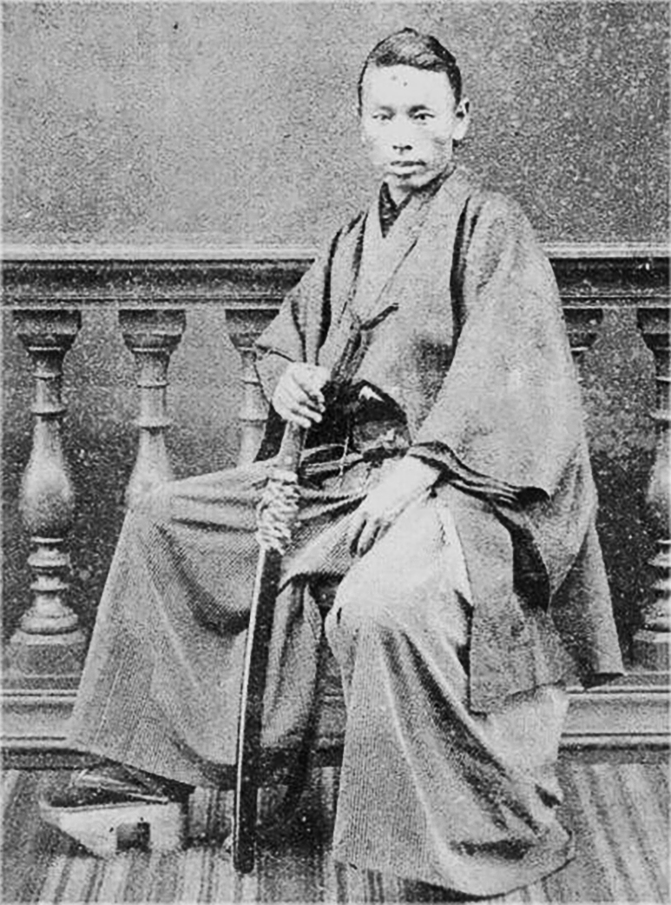

# 井上馨：长州藩的钱袋子，鹿鸣馆里的生意人

话说明治十六年（1883年），东京日比谷新落成了一座洋楼，取了个风雅的名字叫"鹿鸣馆"。开业那天，日本的达官贵人们穿着西装礼服，夫人们套上了蓬蓬裙，在这座模仿欧洲宫廷的建筑里跳华尔兹、喝香槟、吃法国菜。

这场面要搁在十几年前的日本，简直不可想象。那时候这些人还穿着和服、踩着木屐，别说跳舞了，叉子都没摸过。

策划这一切的人，就是时任外务卿井上馨。他的逻辑很简单：西方人不跟你签平等条约，是因为觉得你是野蛮人。那好，我就让你看看，日本人也能跳舞、也能喝红酒、也能穿燕尾服。你总不能说一个跟你一起跳华尔兹的民族是野蛮人吧？

这个想法听起来有点天真，但在那个年代，这是井上馨能想到的最快的办法。

可后来的事实证明，鹿鸣馆外交是失败的。西方人看了之后的反应不是"哇日本人好文明"，而是"这些东方人在模仿我们的样子，真可笑"。法国漫画家甚至画了讽刺漫画，嘲笑日本人东施效颦。

井上馨的鹿鸣馆，就这样从一个外交工具变成了一个笑柄。但如果你因此就小看井上馨，那就大错特错了——因为这个人的真正厉害之处，不在外交，而在商业。

---

**偷渡英国的长州少年**

井上馨，天保六年（1835年）生于长州藩。跟大多数长州志士一样，他年轻时也是个热血的尊王攘夷派。但他跟别人不一样的是——他不光会喊口号，还特别会算账。

文久三年（1863年），井上馨和伊藤博文等五个长州藩的年轻人做了一件惊天动地的事——偷渡到英国留学。这就是历史上著名的"长州五杰"。

您想想看，那个年代私自出国是死罪，而且长州藩正在跟幕府对着干，局势紧张得一触即发。可这五个年轻人居然偷偷摸摸地坐上了英国商船，横渡大洋去了伦敦。

到了英国之后，井上馨和伊藤博文见识了工业革命的成果，看到了蒸汽机、铁路、工厂……一下子就明白了：靠刀剑是打不过西方人的，必须学他们的技术和制度。

特别是井上馨，他在英国最关注的不是军事，也不是政治，而是经济。他看到英国的商业体系是如何运转的，看到资本是如何推动国家发展的，心里暗暗记下了一笔账：日本要强大，首先得有钱。

可还没等他学够，国内就出了大事——下关战争爆发了，长州藩被英法美荷四国联军炮轰。井上馨和伊藤博文赶紧回国，试图调停。虽然调停没成功，但这段经历让他们成了长州藩里最了解西方的人。

---

**差点被砍死的外交家**

回国后的井上馨投入了倒幕运动。可在一次藩内的政治斗争中，他被保守派砍了好几刀，差点死掉。据说全身上下留下了七八道刀伤，脸上也被划了一刀，从此留下了一道显眼的疤痕。

这事对井上馨的影响很大。他从此变得更加务实，不再追求什么高大上的政治理想，而是把精力放在了更实际的事情上——赚钱和搞关系。

维新成功后，井上馨进入了新政府，主要负责财政事务。他和涩泽荣一一起推动了早期的金融改革，包括建立国立银行制度、统一货币等。

但井上馨跟涩泽荣一有一个根本的区别——涩泽荣一虽然也是商人，但他讲究"论语和算盘"，就是赚钱也要讲道德；井上馨则更加赤裸裸，他认为商业就是商业，利益就是利益，不需要穿上道德的外衣。

---

**政商关系的祖师爷**

来，咱们细细道来井上馨最有争议的一面——政商关系。

井上馨可以说是日本"政商勾结"的祖师爷。他在政府里的时候，利用职务之便结交了大量的商人，特别是三井财阀。后来他甚至被人叫做"三井的管家"——意思是他不像一个政府官员，倒像是三井家族的私人代理人。

具体怎么操作呢？比如说，政府要搞什么大工程，他就把合同介绍给跟自己关系好的商人。商人赚了钱，自然要回馈。这种操作在今天叫做利益输送，是要进监狱的。但在明治初期，法律不完善，政商之间的界限模糊得很，很多人都在这么干，井上馨只是干得最大胆、最明目张胆。

明治六年（1873年），一桩财务丑闻曝光，井上馨被迫辞去了大藏省的职务。表面上是因为他的财政政策跟大久保利通有分歧，实际上是因为他利用职务之便给自己和朋友捞了不少好处，被人举报了。

辞职后的井上馨去干什么了？去经商了。凭借在政府里积累的人脉和信息，他在商界混得风生水起。几年后又被请回了政府，担任外务卿。

---

**鹿鸣馆的失败**

说回鹿鸣馆。

井上馨当外务卿期间最重要的任务是修改不平等条约。他想出的办法就是——让日本看起来跟西方一样"文明"。

鹿鸣馆就是这个策略的产物。每个星期都有舞会，日本的高官和外国公使在这里觥筹交错、翩翩起舞。井上馨自己也是舞会的常客，据说他跳华尔兹跳得还不错。

可问题是，穿上西装不等于变成西方人。列强看重的不是你会不会跳舞，而是你的法律制度够不够完善、你的司法体系独不独立。鹿鸣馆那套表面功夫，根本打动不了西方人。

更致命的是，井上馨提出的修约方案里有一条——在日本的法院设置外国法官。这条一曝光，国内舆论炸了锅。你这是修约还是卖国？连鹿鸣馆里跳舞的那些人都觉得过分了。

明治二十年（1887年），井上馨在一片骂声中辞去了外务卿的职务。鹿鸣馆虽然还在那里，但再也没有了当年的热闹。它后来被改成了别的用途，最终在昭和时代被拆除了。

---

**影子权力者**

辞去外务卿之后，井上馨并没有真正退出权力舞台。他的角色变了——从台前走到了幕后。

作为长州藩阀的核心人物，井上馨跟伊藤博文、山县有朋是同辈的老兄弟。虽然他没有像他们那样当首相，但他一直在幕后发挥着巨大的影响力。历届内阁的组建，他都有发言权；政府跟财阀之间的沟通，他是最重要的桥梁。

说白了，井上馨的角色更像是今天的"顾问"或者"说客"——他不直接掌权，但谁掌权都得给他面子。因为他手里有两张王牌：一张是长州藩阀的人脉网络，另一张是跟三井等财阀的深厚关系。

有人评价井上馨说："他是那种你在正史里看不到几笔，但在每一个重大决策的背后都能找到他影子的人。"这个评价相当到位。

---

**功过参半的一生**

大正四年（1915年），井上馨去世，享年七十九岁。

评价井上馨，得分两面看。

正面来说，他是日本近代化的重要推手。他参与了长州五杰的英国留学，带回了西方的经济思想；他推动了早期的金融改革，帮助建立了现代银行制度；他主导的鹿鸣馆虽然失败了，但至少让日本统治阶层开始认真思考"现代化到底是什么"这个问题。

负面来说，他是日本政商勾结的始作俑者。他把政治和商业搅在了一起，开了一个很坏的先例。后来日本的财阀政治、金权政治，很大程度上都是从他这里开始的。"三井的管家"这个外号不是白叫的。

这就好比一个公司的创始人，他确实把公司做大了，但他用的方法——行贿、暗箱操作、利益输送——也给公司留下了洗不掉的黑历史。

不过话说回来，明治维新本身就是一场充满妥协和交易的革命。想要在短短几十年内让一个封建国家变成现代化强国，光靠理想是不够的，还得有人去做那些"脏活"。井上馨做的就是这种脏活——不光彩，但也许是必要的。

*有人负责喊"维新万岁"，有人负责冲锋陷阵，还有人负责算账收钱。井上馨属于第三种——历史不会感谢他，但历史离不开他。*
