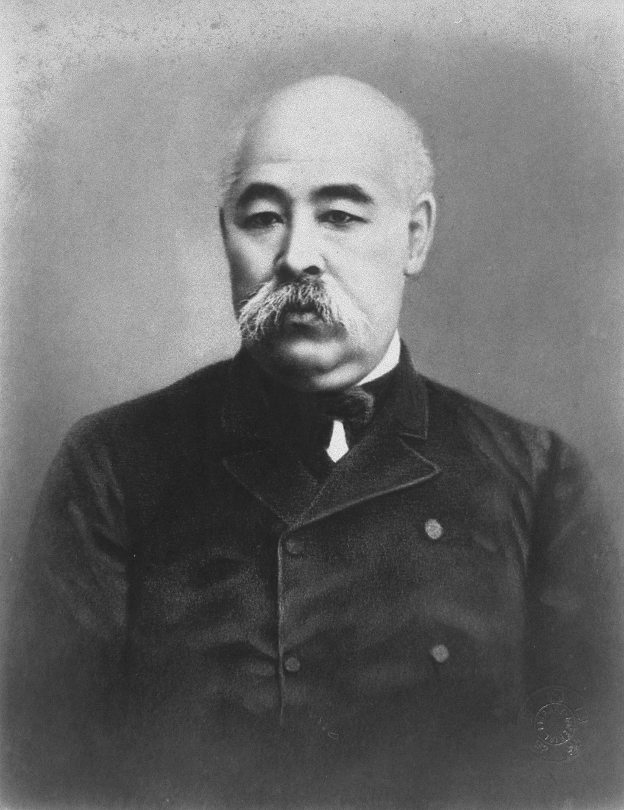
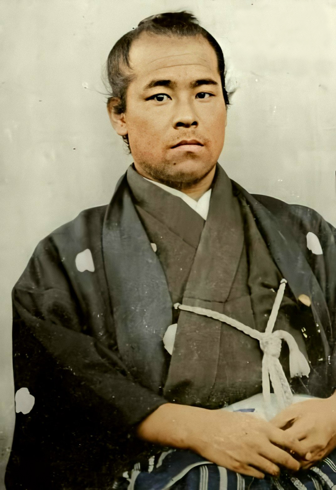
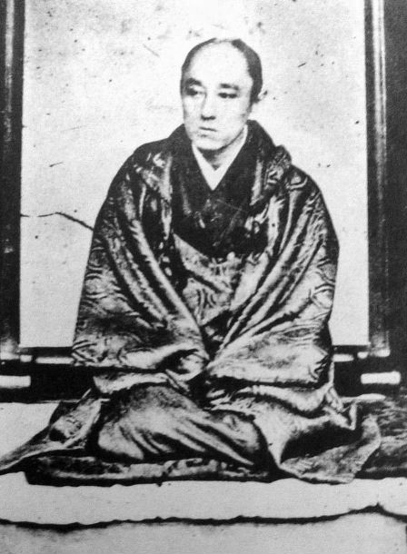

# 后藤象二郎：大政奉还的真正推手，土佐藩的政治掮客

话说庆應三年（1867年），坂本龙马提出了一个石破天惊的方案——让将军主动把权力交还给天皇。这个方案叫"大政奉还"，后来成了幕末最重要的政治事件之一。

大多数人都把这个功劳记在了坂本龙马头上。没错，龙马确实是大政奉还的构想者。但如果没有一个人把这个构想变成现实，它可能永远只是一张纸上的蓝图。

这个人就是后藤象二郎——土佐藩的参政，山内容堂的心腹，也是一个比坂本龙马更善于在权力场上周旋的政治掮客。

龙马负责画饼，后藤负责把饼做出来。这对搭档的配合，是大政奉还能够成功的关键。

---

**土佐上士的骄傲**

后藤象二郎，天保九年（1838年）生于土佐藩，出身上士阶层。

在土佐藩，武士分为"上士"和"下士"两个等级，泾渭分明。上士是山内家带来的家臣后代，享有各种特权；下士则是原本土佐当地的武士，被征服后地位低下。坂本龙马、武市半平太、中冈慎太郎都是下士出身，后藤象二郎则是正儿八经的上士。

这个身份区别很重要。它意味着后藤象二郎天生就有接近权力核心的通道——他不需要像龙马那样脱藩出走、到处流浪，他可以直接在藩政系统内发挥影响力。

后藤象二郎的叔父吉田东洋是土佐藩的重臣，也是藩政改革的推动者。可惜吉田东洋在文久二年（1862年）被土佐勤王党暗杀了。这件事对后藤影响很大——一方面让他对勤王党深恶痛绝，另一方面也让他继承了叔父的政治遗产，在藩政中逐步崛起。

---

**从仇人到搭档**

后藤象二郎跟坂本龙马的关系，怎么说呢，一开始是对立的。

龙马是下士出身，还加入过土佐勤王党。而后藤象二郎是上士，叔父又是被勤王党杀的。从身份和立场上来说，两个人应该是死对头。

可政治这东西，没有永远的敌人。

庆应三年（1867年），后藤象二郎在长崎遇到了坂本龙马。当时日本的局势已经明朗——幕府大势已去，萨摩和长州随时准备武力倒幕。土佐藩夹在中间，既不想跟萨长一起打仗（打不过人家），又不想被排除在新政权之外。

龙马给后藤指了一条路：大政奉还。如果由土佐藩出面建议将军主动交权，那土佐就能在新政权中占据有利位置——既不用打仗，又有了功劳。

后藤象二郎一听，眼睛亮了。这不正是土佐藩最需要的方案吗？

从此，这两个原本互相看不顺眼的人成了政治搭档。龙马负责出谋划策，后藤负责在藩政高层推动执行。

---

**说服山内容堂**

大政奉还这个方案要落地，必须过一关——说服藩主山内容堂。

山内容堂虽然主张公武合体，但让他出面去劝将军交权，这个风险可不小。万一将军不同意，觉得你土佐藩在搞阴谋怎么办？万一将军同意了，但新政权不买土佐的账怎么办？

后藤象二郎的厉害之处就在这里——他用了三步棋说服了山内容堂。

第一步，他跟龙马一起起草了"船中八策"，把大政奉还后的新政体框架描绘得清清楚楚：天皇亲政、设立议会、广纳人才、开国通商。这让山内容堂看到了一个可行的蓝图。

第二步，他利用自己在土佐藩政中的影响力，说服了其他重臣支持这个方案。一个人提建议容易被否决，一群人提建议就不一样了。

第三步，他帮山内容堂分析利弊：如果土佐不提大政奉还，萨长迟早会武力倒幕，到时候土佐就彻底没有话语权了。与其被动等待，不如主动出击。

山内容堂被说服了。庆应三年十月，他正式向将军德川庆喜提出了大政奉还的建议。十月十四日，德川庆喜接受了这个建议。

两百六十年的幕府统治，和平结束了。

---

**功臣的尴尬处境**

可大政奉还的"和平果实"并没有维持多久。

萨摩和长州根本不打算让德川家在新政权中保有实权。小御所会议上，岩仓具视和大久保利通强行通过了"辞官纳地"的决议，把德川家的权力和领地全部剥夺。随后鸟羽伏见之战爆发，内战还是打了起来。

后藤象二郎和山内容堂推动的"和平方案"，最终被战争的洪流冲得七零八落。大政奉还成了一个过渡性的政治手段，而不是最终的解决方案。

这对后藤象二郎来说是很尴尬的。他费了那么大的力气推动大政奉还，结果还是打了起来，那他的功劳算什么？

更尴尬的是，戊辰战争之后的新政府基本上被萨摩和长州把持。土佐虽然也参加了战争，但话语权远远不如萨长。后藤象二郎虽然进入了新政府，但一直没有得到与他自认为的功劳相匹配的地位。

---

**征韩论与下野**

明治六年（1873年），征韩论政变爆发。后藤象二郎站在了"征韩派"一边——主张出兵朝鲜。

这个立场跟他的政治处境有关。在萨长把持的新政府里，土佐系的人越来越边缘化。后藤象二郎希望通过对外扩张来打开局面，让军功给自己争取更大的话语权。

可征韩派输了。大久保利通和岩仓具视联手否决了出兵方案，西乡隆盛、板垣退助、后藤象二郎等人相继辞职下野。

下野之后，后藤象二郎加入了板垣退助的自由民权运动，参与创建了立志社和爱国社。但他在民权运动中的角色更像是一个投机者——运动好的时候他跟着喊，运动不好的时候他就去找政府谈条件。

明治十四年（1881年），后藤象二郎接受了政府的邀请去欧洲考察。在民权运动正需要领袖的时候，他跑去欧洲旅游了。这个举动让很多同志失望透顶。

---

**晚年的浮沉**

后藤象二郎晚年的政治生涯乏善可陈。他在几届内阁中担任过大臣，但都没有留下什么特别的政绩。他跟板垣退助一起搞过短暂的政党联合，也跟伊藤博文等人做过妥协，但始终没有找到一个稳定的政治定位。

明治三十年（1897年），后藤象二郎去世，享年五十九岁。

---

**政治掮客的命运**

怎么评价后藤象二郎？

他最大的功绩毫无疑问是推动了大政奉还。没有他在藩政高层的周旋，坂本龙马的构想可能只是一纸空文。这一点谁也否认不了。

可他的问题也很明显——他是一个典型的"掮客"型政治家。他的能力在于协调、周旋、做交易，而不在于坚持原则。当环境有利的时候，他能做出漂亮的成绩；当环境不利的时候，他就左右摇摆、见风使舵。

这就好比一个中间商——有好货的时候他能卖出好价钱，可他自己不生产任何东西。坂本龙马是生产者，山内容堂是买家，后藤象二郎是中间商。交易做成了，他有功劳；交易之后的事情，就不在他的能力范围内了。

*大政奉还是后藤象二郎最漂亮的一笔交易，也是他政治生涯的天花板。有些人一辈子只做对了一件大事，但那一件大事就够了。*
