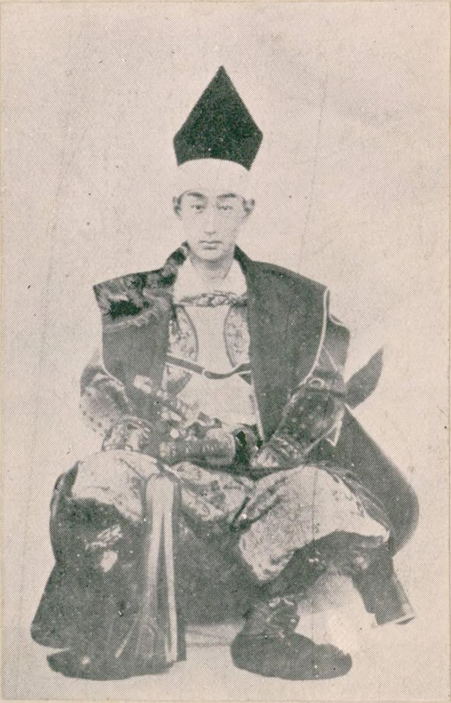
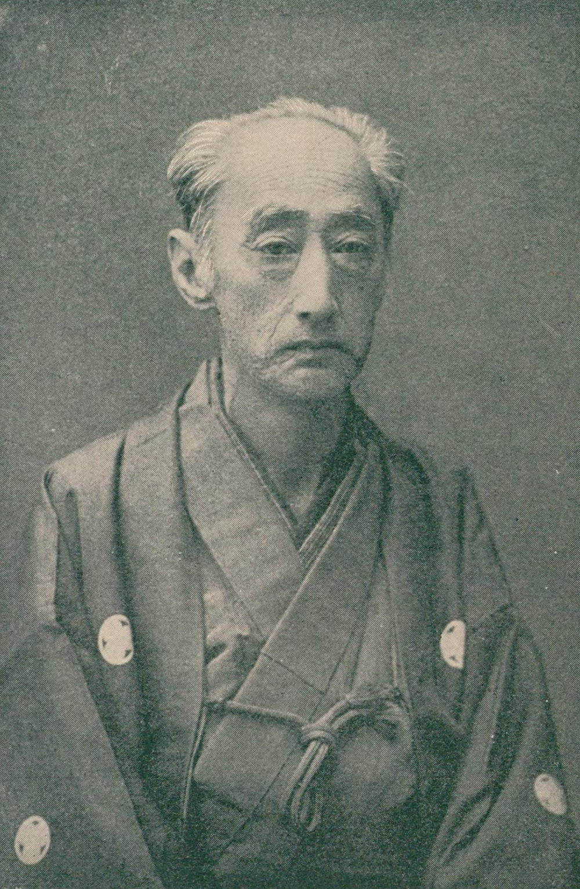
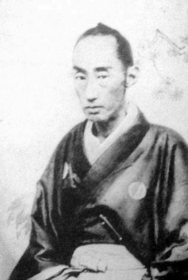

# 松平容保：最忠诚的人，下场最惨

*松平容保肖像*

话说幕末那些藩主里头，有人投机倒把，有人见风使舵，有人两面三刀。可有一个人，从头到尾就认一个死理——忠于将军，忠于幕府。

这个人叫松平容保，会津藩第九代藩主。

他的忠诚，换来的不是嘉奖，而是灭顶之灾。会津战争中，他的藩士战死数千，白虎队少年集体自刃于饭盛山，整个会津若松城在炮火中化为焦土。战后，会津藩被改易，残存的藩士被流放到下北半岛那片鸟不拉屎的苦寒之地。

一个人忠诚到了极致，可忠诚的对象却轰然倒塌了，他的忠诚还有意义吗？

松平容保的一生，就是对这个问题最痛苦的回答。

---

**高须四兄弟**

松平容保，天保六年（1836年）生于美浓国高须藩松平家。他不是会津藩土生土长的人，而是以养子身份入继会津松平家的。

高须藩松平家是尾张德川家的支系，容保的亲兄弟里出了好几个了不起的人物——哥哥德川庆胜后来成了尾张藩主，弟弟松平定敬后来当了桑名藩主。兄弟几个在幕末都站在了幕府一边，被称为"高须四兄弟"。

容保十二岁被过继到会津藩，继承了会津松平家的家督。会津藩有一条祖训，是初代藩主保科正之定下的——"会津藩主必须以将军家为第一，如有二心，即非我子孙"。

这条祖训，成了松平容保一生的枷锁。

---

**京都守护职**

文久二年（1862年），幕府给松平容保下了一道命令——出任京都守护职。

什么是京都守护职？说白了就是让你去京都维持治安。当时京都到处都是尊王攘夷的志士，天天搞暗杀、纵火、闹事，朝廷也被激进派公卿把持着。幕府需要一个有实力的藩主去京都镇场子。

这个活儿，谁都不想干。为什么？因为它是个烫手山芋——干好了没人感谢你，干砸了身败名裂。而且维持京都治安的费用巨大，会把藩的财政拖垮。

容保一开始也不想去。他的家臣西乡赖母等人极力反对，认为这个职务会把会津藩拉入政治漩涡。

可容保想起了那条祖训——"以将军家为第一"。将军有难，他怎么能袖手旁观？

他接了。

从这一刻起，会津藩就踏上了一条不归路。

*担任京都守护职时期的松平容保*

---

**新选组的靠山**

松平容保到了京都之后，干了一件让后世津津乐道的事——他收编了浪士组中的近藤勇、土方岁三一伙人，成立了"新选组"，作为京都守护职的直属武装。

新选组在京都的名头有多响，不用多说了。池田屋事件、禁门之变，他们替容保维持了京都的秩序，也替幕府挡了不少枪。

可新选组的存在也让容保彻底得罪了倒幕派。在萨摩和长州眼里，新选组就是会津的打手，容保就是幕府在京都的代言人。将来清算的时候，第一个要收拾的就是你。

容保本人对此恐怕也有预感。但他的性格决定了他不会退缩——既然接了京都守护职，就要干到底。

---

**孝明天皇的信任**

在那个人人都往倒幕方向靠的年代，松平容保有一个别人没有的优势——孝明天皇信任他。

孝明天皇虽然主张尊王攘夷，但他并不希望推翻幕府。相反，他觉得公武合体才是正途。在这一点上，容保跟孝明天皇的立场是一致的。

孝明天皇多次赐予容保亲笔书信，感谢他在京都维持秩序、抵挡过激派。据说容保把这些御书视若珍宝，一生随身携带。

这些御书，在容保心中有着特殊的意义——它证明了他的所作所为不仅仅是忠于将军，也是忠于天皇。他不是什么"朝敌"，他是天皇亲口嘉许过的忠臣。

可惜，庆应二年（1866年），孝明天皇突然驾崩了。容保失去了最大的政治靠山。新即位的明治天皇年幼，朝政被岩仓具视等倒幕派公卿掌控。从此以后，容保的一切正当性都被剥夺了。

*明治维新后的松平容保*

---

**鸟羽伏见的崩溃**

庆应四年（1868年）正月，鸟羽伏见之战爆发。

这场战役的经过就不细说了，关键是结果——幕府军惨败，德川庆喜扔下军队连夜从大阪坐船逃回了江户。

您想想容保当时的心情。他千里迢迢从会津到京都，花了六年时间替幕府卖命，结果将军自己先跑了？他忠诚的对象，把他当弃子了。

但即便如此，容保没有投降。他跟着庆喜回到了江户，然后又回到了会津。他要回去保卫自己的藩，保卫自己的人民。

新政府给会津藩下了最后通牒——要么投降，要么被灭。容保的家臣分成了两派，主战派和主和派争得不可开交。容保本人据说是想投降的，但主战派的声音太强了，加上会津藩上下对新政府的仇恨已经到了极点——凭什么萨长就是"官军"，我们就是"朝敌"？

会津决定抵抗到底。

---

**会津的毁灭**

明治元年（1868年）八月到九月，会津战争爆发。

新政府军以压倒性的兵力和火力围攻会津若松城。会津藩殊死抵抗，男女老幼都投入了战斗。

白虎队——一支由十六七岁少年组成的队伍，在户口原之战后撤退到饭盛山。他们远远望见若松城方向浓烟滚滚，以为城已经陷落了，二十名少年集体自刃。实际上城还没有落，他们看到的只是城下町的大火。

这个场景，是幕末最令人痛心的画面之一。

娘子军——以城主容保的养母照姬为首，会津的女性们也拿起了武器。中野竹子率领的薙刀队在战场上与新政府军白刃格斗。更有数百名女性在城破前选择了自尽，不愿落入敌手。

一个月的围城之后，若松城弹尽粮绝。松平容保终于决定投降。

开城那天，容保穿着丧服，带着孝明天皇的御书走出城门。他想证明自己不是朝敌，他有天皇的嘉许。

可新政府根本不想听。在胜者的叙事里，会津就是逆贼，容保就是朝敌。什么御书不御书的，那是前一个天皇的事了。

---

**流放与余生**

战后，松平容保被幽禁，后来被释放。会津藩被改易，领地被没收，残存的藩士被迁移到下北半岛的斗南藩。

斗南藩是什么地方？那是本州最北端的荒凉之地，冬天零下二十多度，土地贫瘠，几乎什么都种不活。一万七千名会津遗民挤在那里，饥寒交迫，每年都有大量人冻死、饿死。

这就是"忠诚"的代价。

容保本人在明治维新之后过得异常低调。他当过日光东照宫的宫司——负责守护德川家康的神社。这个安排既是一种安置，也像是一种象征：你既然这么忠于德川家，那就去给德川家守庙吧。

明治二十六年（1893年），松平容保去世，享年五十七岁。

据说他至死都随身带着孝明天皇赐予的御书。那些发黄的纸页，是他一生清白的证据，也是他一生悲剧的起点。

---

**忠诚的悖论**

怎么评价松平容保？

同情他的人说，他是日本最后一个真正的武士——受命于危难之际，忠义两全，至死不渝。他没做错任何事，他只是站在了历史的输家那一边。

批评他的人说，他的顽固导致了会津的毁灭。如果他能早一点认清形势，选择投降，几千条人命和一座城池就不会被白白牺牲。

可您想想看，这两种评价都成立，恰恰说明了"忠诚"这个概念本身的悖论——当你忠诚的对象已经不值得忠诚的时候，你的忠诚是美德还是愚蠢？

容保的一生就像一把双刃剑——忠诚是他最大的美德，也是他最大的悲剧。他用一生证明了一个残酷的道理：在历史的转弯处，对的人不一定赢，忠诚的人不一定有好下场。

*有人说，会津的眼泪到今天都没有干。松平容保如果泉下有知，大概会说：我不后悔我的忠诚，但我后悔没能保住我的人民。这，才是一个藩主最大的痛。*
