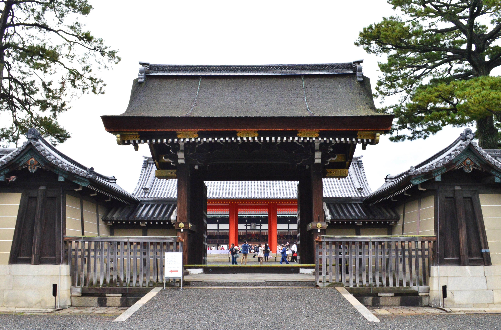
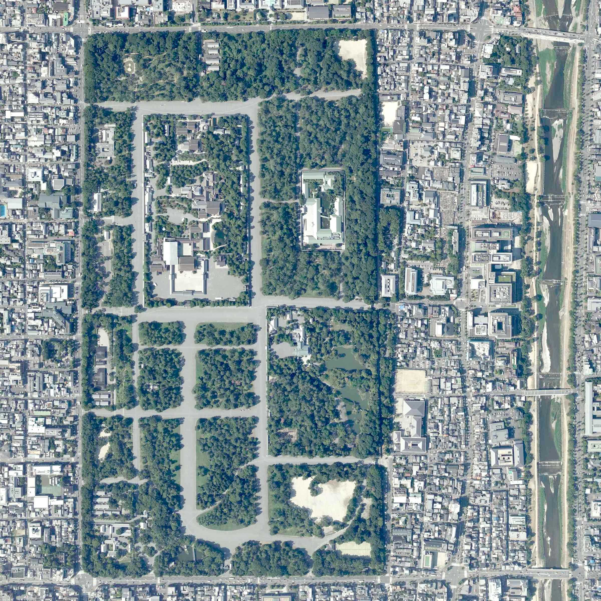

# 久坂玄瑞：长州激进派的急先锋，死在二十五岁

*久坂玄瑞（1840-1864），吉田松阴门下双璧之一，长州藩尊攘运动的急先锋*

话说吉田松阴有两个最得意的弟子，一个是高杉晋作，另一个就是久坂玄瑞。

高杉晋作活到了二十七岁，好歹看到了倒幕的曙光。久坂玄瑞更惨——他二十五岁就死了，死在了禁门之变的烈火中。

松阴先生评价这两个学生："久坂是锋利的长矛，高杉是灵活的宝刀。"长矛适合冲锋陷阵，宝刀适合变幻莫测。久坂玄瑞这辈子就像一把长矛——永远冲在最前面，从不知道后退，最终折断在了战场上。

可问题是，禁门之变本来就不该打。久坂玄瑞的死，到底是壮烈殉国，还是冲动误事？

---

**松下村塾的双璧**

久坂玄瑞，天保十一年（1840年）生于长州藩。他爹久坂良迪是藩医，家境还算不错。可久坂玄瑞从小就不安分，十几岁的时候就开始关心天下大事。

安政三年（1856年），久坂玄瑞进入了吉田松阴的松下村塾学习。这一年他十七岁。

在松下村塾里，久坂玄瑞迅速展现出了惊人的才华。他文笔了得，辩才无碍，对时局的分析头头是道。松阴先生对他赞不绝口，甚至把自己的妹妹嫁给了他——这在当时是师徒关系中最高规格的认可。

久坂玄瑞和高杉晋作是同门中最出色的两个人，被称为"松下村塾的双璧"。两人年纪相仿，才华相当，性格却截然不同。高杉晋作机变百出，善于因势利导；久坂玄瑞热血刚烈，认准了一条路就一头扎到底。

安政六年（1859年），松阴先生因"安政大狱"被处刑。师父的死对久坂玄瑞刺激极大——他发誓要继承师父的遗志，用行动推翻幕府，实现尊王攘夷。

从这一刻起，久坂玄瑞就走上了一条不归路。

---

**攘夷运动的旗手**

松阴先生死后，久坂玄瑞成了长州藩尊攘运动的核心人物之一。

他四处奔走，联络各藩的尊攘派志士，在京都和江户之间穿梭。他的口才和热情感染了很多人，迅速成为了尊攘运动中最活跃的年轻领袖。

文久二年（1862年），久坂玄瑞参与策划了英国公使馆的焚烧事件。是的，他们直接放火烧了英国人在品川的公使馆。这个举动在当时被认为是"攘夷的壮举"，虽然从今天的角度看，这就是赤裸裸的恐怖袭击。

文久三年（1863年），长州藩响应朝廷的"攘夷敕令"，在下关海峡炮击了美法荷三国的商船。久坂玄瑞虽然不是直接指挥者，但他是推动长州藩走向激进攘夷路线的关键人物之一。

这些行动给长州藩带来了巨大的声望——在尊攘派眼中，长州是唯一敢对洋人开炮的藩。可它们也把长州推向了悬崖边缘——列强的报复只是时间问题。

---

**八月十八日政变**

文久三年（1863年）八月十八日，政变来了。

萨摩藩和会津藩联手，把长州藩的势力从京都彻底清除。尊攘派公卿七人被迫逃离京都（"七卿落"），长州藩的军队被驱逐出了御所周边。

这场政变对久坂玄瑞和长州藩来说是晴天霹雳。他们在京都经营多年的政治布局一夜崩溃，从"天皇身边的忠臣"变成了"被驱逐的乱党"。

更让他们愤怒的是，政变的主谋之一是萨摩藩。长州和萨摩本来都是尊攘派，结果萨摩倒戈了，跟会津藩联手把长州给卖了。

这种背叛的感觉，让长州藩上下群情激愤。久坂玄瑞更是怒不可遏——他主张立刻以武力夺回京都，恢复长州在朝廷中的地位。

---

**禁门之变**

*京都皇宫建礼门，禁门之变的主要战场之一*

元治元年（1864年）七月，长州藩做了一个致命的决定——武力上洛，夺回在京都的失去的地位。

这就是"禁门之变"，也叫"蛤御门之变"。

久坂玄瑞是主战派的核心。他率领一支队伍，从京都西面进攻皇宫方向。同时，来岛又兵卫也率军从另一个方向包抄。长州藩的计划是两路夹击，突入御所，面见天皇，证明长州不是叛军。

可这个计划从一开始就是错误的。

首先，武力进攻京都等于跟整个幕府体制为敌。即便你的动机是"勤王"，但向皇宫方向开枪这件事本身，就让你在法理上变成了"朝敌"。

其次，长州藩的兵力远远不够。他们带了几百人进京，对面是会津藩、萨摩藩和其他亲幕府势力的数千兵马。以少打多，在敌方主场作战，这仗怎么打？

更要命的是，长州藩内部也不是铁板一块。高杉晋作就反对这次行动，他认为时机不对，应该等待。但久坂玄瑞等人的主战情绪已经压过了一切理性的声音。

战斗打响后，长州军一度攻到了蛤御门附近。久坂玄瑞的部队冲杀勇猛，一度让幕府军措手不及。可萨摩藩的援军赶到后，局势急转直下。长州军陷入了重围，死伤惨重。

激战中，久坂玄瑞见大势已去，在鹰司邸附近自刃身亡。终年二十五岁。

来岛又兵卫战死，真木和泉也在天王山自刃。禁门之变以长州藩的惨败告终。

---

**一把烈火**

*京都御苑全景，禁门之变后大火波及的区域*

禁门之变的后果是灾难性的。

长州藩被朝廷宣布为"朝敌"，幕府随后发起了第一次征长战争。京都在战斗中发生了大火（"蛤御门之火"），大片城区被烧为废墟。京都百姓把这场火灾叫做"铁炮焼（枪炮引起的大火）"，对长州藩恨之入骨。

长州藩的政治声誉一落千丈。之前他们是"勤王义士"，现在他们是"御所放火的朝敌"。这个标签一直到萨长同盟成立后才逐渐洗掉。

久坂玄瑞的死在长州藩内部也引发了深刻的反思。主战派的冒进导致了如此惨重的后果，让更多人转向了高杉晋作的路线——先稳住内部，壮大实力，等待时机。

某种意义上，久坂玄瑞的失败为高杉晋作的成功铺了路。如果没有禁门之变的教训，长州藩可能还会继续在激进路线上一意孤行。正是因为撞了南墙，他们才学会了绕路。

---

**急先锋的宿命**

怎么评价久坂玄瑞？

他的才华毋庸置疑。松阴先生不会随便把妹妹嫁人，能得到松阴如此看重，说明久坂确实有过人之处。他的文章、他的演说、他对时局的分析，在当时的年轻志士中都属于顶尖水平。

他的勇气也毋庸置疑。在所有人都在观望的时候，他敢于行动；在所有人都在退缩的时候，他选择冲锋。

可他最大的问题是——只会冲，不会退。

打仗讲究进退有据，政治更讲究审时度势。久坂玄瑞空有一腔热血，却缺乏高杉晋作那种见机行事的灵活性。他把"忠义"理解成了"永远往前冲"，却忘了有时候后退一步才能跳得更远。

这就好比一个创业团队里最拼命的合伙人——他确实是公司最努力的人，但如果他分不清什么时候该冲、什么时候该稳，最终可能把整个团队带进沟里。

*久坂玄瑞二十五年的人生，像一颗流星——划过天际的那一刻光芒万丈，可惜太短了。也许他的悲剧不在于死得太早，而在于他的时代还没有准备好接住他的热血。先驱者的命运，往往就是用自己的身体去填前方的坑，好让后来的人走过去。*
