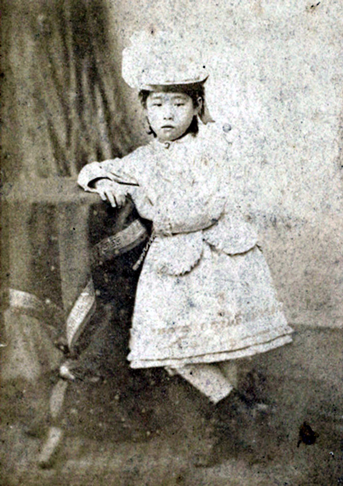
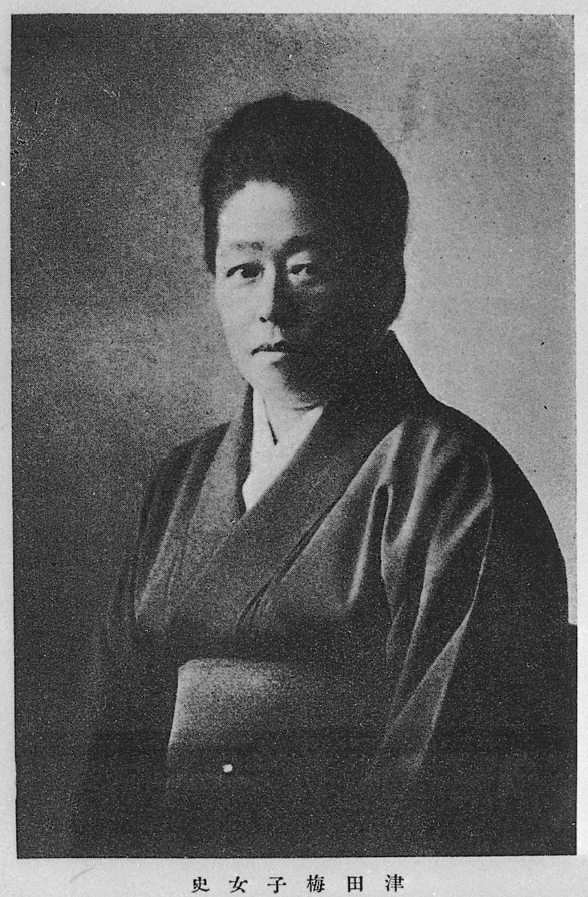

# 津田梅子：六岁留学美国的女孩，五千元纸币的新面孔

话说明治四年（1871年），岩仓使节团出发前往欧美考察。这个使节团里有一群特殊的成员——五个年纪最小只有六岁的日本女孩，被政府派去美国留学。

六岁啊。放到今天，六岁的孩子还在幼儿园里玩沙子呢，人家已经要漂洋过海去异国他乡了。

这五个女孩中最小的那个，叫津田梅子。

五十多年后，她创建了津田塾大学——日本最顶尖的女子高等教育机构之一。2024年，她的肖像被印在了新版五千元纸币上——这是日本纸币上首次出现致力于女性教育的人物。

一个六岁就被送出国的小女孩，是怎么成长为日本女子教育的旗手的？

---

**被父亲"卖"给了国家**

津田梅子，明治二年（1864年）生于江户。她的父亲津田仙是一个很有意思的人——他是幕府时代的翻译官，维新后成了农学家和基督教徒。津田仙思想非常开明，在那个女人不需要读书的年代，他坚信女孩也应该接受最好的教育。

明治四年，新政府决定向美国派遣女子留学生——这在日本历史上是头一遭。政府的动机说起来也不全是为了女性解放，更多是想展示"日本也在追赶文明"的姿态。

津田仙听说了这个消息，二话不说就给六岁的梅子报了名。

六岁的梅子大概还不太明白发生了什么。她只知道自己被放到了一艘大船上，船上有很多奇奇怪怪的外国人，然后船开了，日本越来越远。

同行的五个女孩中，有两个到了美国之后水土不服，很快就回国了。坚持下来的只有三个人，梅子是其中最小的一个。

---

**美国的十一年**

梅子在美国被寄养在兰曼夫妇的家庭里。兰曼先生是华盛顿特区的一位知名人士，兰曼太太对梅子视如己出。

在这个美国家庭里，梅子接受了完整的西方教育。她学英语、学法语、学钢琴、学绘画，上的是当地最好的学校。她渐渐忘记了日语——是真的忘了，不是夸张。一个六岁就离开日本的孩子，在全英文的环境里生活了十一年，日语退化到几乎不会说了。

她还接受了基督教的洗礼，成为了一名虔诚的基督徒。信仰在后来的人生中给了她巨大的精神力量。

明治十五年（1882年），十八岁的津田梅子回到了日本。

可迎接她的不是鲜花和掌声，而是一种深深的不适感。

---

**回国后的冲击**

回国后的津田梅子发现，日本跟她想象中的完全不一样。

首先，她几乎不会说日语了。一个日本人不会说日语，这在当时简直是天方夜谭。她花了好几年才重新学会母语。

其次，日本女性的地位让她震惊。在美国生活了十一年，她习惯了女性可以自由表达意见、自由追求事业。可回到日本一看——女人不能上大学、不能从政、不能继承财产，结了婚就是丈夫的附属品。

这种反差让梅子陷入了深深的困惑。她不知道自己该怎么办——回美国吗？那不是她的祖国。留在日本吗？她在这里格格不入。

梅子先是在华族女学校（贵族女子学校）当了英语老师。可她很快发现，这些贵族女孩学英语只是为了嫁个好丈夫时能在社交场上不丢面子。没有人真的在乎教育本身的价值。

这让梅子坚定了一个信念：日本需要的不是培养"好太太"的女子学校，而是培养独立思考的女性的真正的高等教育。

---

**第二次留学**

明治二十二年（1889年），津田梅子再次前往美国，这次是去布林莫尔学院深造。

布林莫尔是美国顶尖的女子文理学院，学术水平极高。梅子在那里学习了生物学，还在实验室里做了关于蛙卵发育的研究，论文发表在了学术期刊上。

一个来自"女人不需要读书"的国家的女性，在美国的顶级学府里做出了被学术界认可的科学研究。这件事本身就是对日本当时女性教育缺失的最大讽刺。

在布林莫尔的三年，梅子不仅深化了学术能力，更坚定了回国办学的决心。她在美国结识了很多支持女性教育的知识分子和慈善家，为将来的办学积累了人脉和资源。

明治二十五年（1892年），梅子回到日本，继续在华族女学校教书。但她的心已经不在这里了——她在酝酿更大的计划。

---

**创建女子英学塾**

明治三十三年（1900年），津田梅子终于实现了她的梦想——创建了"女子英学塾"。这就是后来的津田塾大学的前身。

学校开办的时候只有十个学生，校舍是一间租来的小房子。没有政府拨款，没有财阀赞助，几乎全靠梅子个人的积蓄和美国朋友的捐助。

但梅子的教育理念是超前的。她不教"如何做一个好妻子"，她教的是英语、文学、自然科学——跟男子学校一样的课程。她要培养的不是贤妻良母，而是能够独立思考、自食其力的现代女性。

这在明治时代的日本有多另类？您想想看，那个年代的主流观点是"女人读太多书会嫁不出去"。梅子偏偏要证明：女人不但要读书，而且要读跟男人一样多的书。

女子英学塾虽然规模不大，但教学质量极高。从这里毕业的学生，很多后来成了教育家、翻译家、社会活动家。学校的名声越来越响，学生也越来越多。

---

**一辈子的事业**

津田梅子把一辈子都献给了女子教育。她终生未婚——不是嫁不出去，而是她选择了事业。

大正八年（1919年），津田梅子因健康原因退休。她的身体一直不太好——几十年的辛苦操劳，再加上来回跨越太平洋的旅途折腾，早就把她的身体搞垮了。

大正十八年（1929年），津田梅子去世，享年六十四岁。

她死后，女子英学塾继续发展壮大，最终改名为津田塾大学，成为了日本女子高等教育的标杆。时至今日，津田塾大学仍然以培养独立、自信的女性而闻名。

---

**纸币上的意义**

2024年，津田梅子的肖像出现在了日本新版五千元纸币上。

这个选择意义深远。日本纸币上印过政治家、文学家、科学家，但印一个毕生致力于女性教育的人，这还是第一次。它意味着日本社会终于正式承认：女性的教育和独立，是国家发展不可或缺的一部分。

可这个承认来得太晚了。津田梅子在一百多年前就在喊的东西——女性要有平等接受教育的权利、女性要有独立的人格、女性的价值不应该用婚姻来衡量——到今天在日本（甚至在全世界很多地方）都还没有完全实现。

*津田梅子六岁离开日本的时候，什么都不懂。六十四岁离开这个世界的时候，她懂了太多。也许她最大的遗憾是：她一个人改变不了整个社会。但她种下的种子，到今天还在发芽。五千元纸币上那张温和的面孔背后，藏着一百多年前一个小女孩倔强的眼神。*
