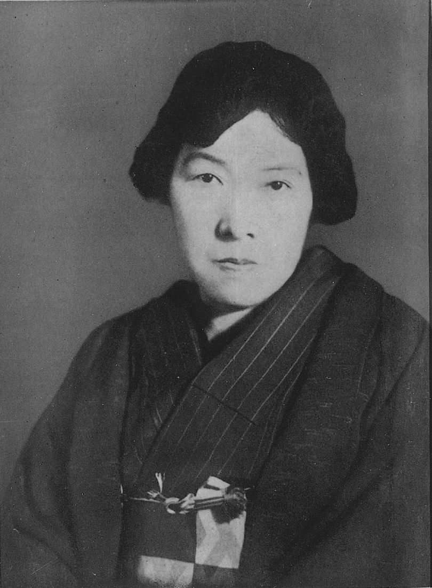
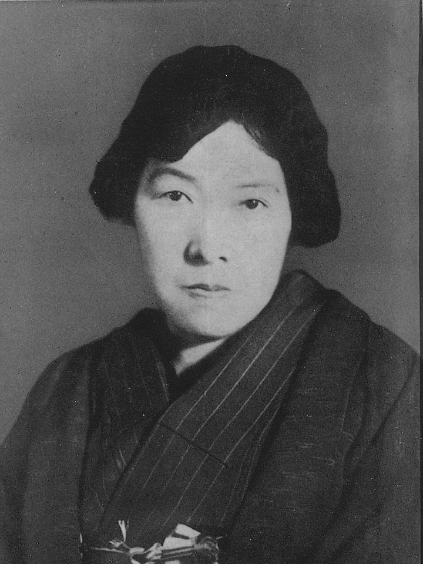
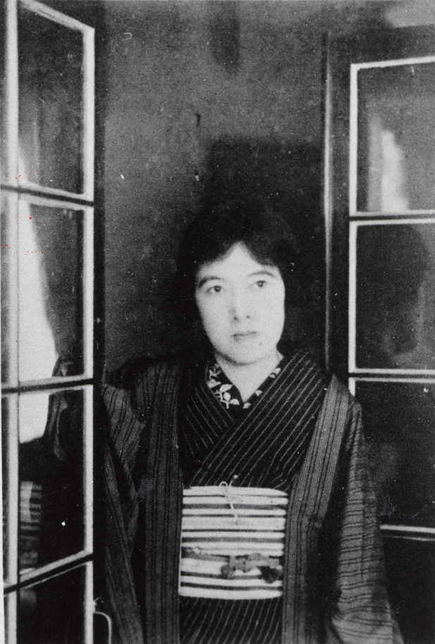

# 与谢野晶子：一首反战诗，让整个日本炸了锅

话说明治三十七年（1904年），日俄战争打得正酣。全日本上下一片"打倒俄国"的狂热之中，一个女诗人在《明星》杂志上发表了一首诗——《你不要死去》。

这首诗的开头是这样的："啊，弟弟，我为你哭泣，你不要死去。"

诗里说的是她弟弟被征召上了前线。她在诗中直白地写道：天皇自己不上战场，凭什么让别人的兄弟去送死？

这在当时是什么概念？全国人民都在喊"为天皇而死是最高荣耀"的时候，一个女人公开说"你不要死"，而且暗示天皇让人送死——这简直是捅了马蜂窝。

这个女人叫与谢野晶子。她不仅是日本近代最伟大的女诗人之一，还是第一个敢在战争狂热中高喊"反战"的文学家。

---

**堺市的商人之女**

与谢野晶子，明治十一年（1878年）生于大阪府堺市。原名凤志よう。她家里是开和果子店的——就是卖日式点心的。

堺市这个地方在历史上就是商人的天下，自由风气很浓。晶子从小就泡在各种书堆里——《源氏物语》《枕草子》，那些平安时代的古典文学她翻来覆去地读。在那个女孩子读太多书会被嫌弃的年代，她偏偏是个书虫。

十几岁的时候，晶子就开始写和歌了。和歌是日本最传统的诗歌形式——五七五七七，三十一个音节。可晶子写出来的东西跟传统和歌完全不是一个味儿。

传统和歌讲究含蓄、典雅、意在言外。晶子偏不。她写的和歌热烈、大胆、直抒胸臆，连爱情里那些大家不好意思说出口的东西都写了进去。

这在当时的日本文坛，就好比在一群穿着正装开会的人中间，突然冲进来一个穿着红裙子跳弗朗明哥的姑娘。

---

**与铁干的爱情**

晶子的人生转折点是遇到了与谢野铁干。

铁干是当时新派和歌运动的领袖，创办了文学杂志《明星》，主张打破旧和歌的条条框框，用更自由、更个性化的方式写诗。晶子读到《明星》杂志后被深深吸引，开始给杂志投稿。

明治三十三年（1900年），铁干到大阪做文学讲座，晶子去听了。两个人一见面，火花四溅。

可问题是——铁干当时已经结婚了。而且他的前一段婚姻也是一团糟。

晶子不管这些。她从堺市跑到了东京，跟铁干在一起了。明治三十四年（1901年），两个人正式结婚。

这段感情在当时引起了不小的争议。一个未婚女子，不顾一切地追到东京去跟一个有妇之夫在一起——放在明治时代的日本，这可是惊世骇俗的事情。

可晶子不在乎。她用行动证明了一件事：她写的那些热烈大胆的诗，不是说说而已。

---

**《乱发》：震动文坛的炸弹**

结婚的同一年（1901年），晶子出版了她的第一部歌集——《乱发》。

这本书一出来就炸了。

《乱发》里收录了三百多首和歌，主题只有一个字：情。而且不是那种含含糊糊的"思君不见"式的情——是赤裸裸的、滚烫的、不加掩饰的爱情和欲望。

她写年轻女子的身体之美，写恋爱中的痴迷与狂热，写女性的自我觉醒。这些在平安时代的女性文学中其实都有过，但到了明治时代反而成了禁忌。晶子把它们重新拉回到了聚光灯下。

保守派文人气炸了，骂她"淫荡""不知廉耻"。可年轻一代的读者疯狂追捧。《乱发》成了明治文学史上的里程碑——它宣告了一种全新的文学声音：女性不再是被书写的对象，而是书写者本身。

您想想看，在一个女人被要求"贤妻良母"的社会里，一个二十三岁的姑娘站出来说"我有权利表达我的欲望"——这种勇气本身就是一首诗。

---

**"你不要死去"**

明治三十七年（1904年），日俄战争爆发。晶子的弟弟凤籟助被征召入伍，送往旅顺前线。

晶子在《明星》杂志上发表了那首震动全国的诗——《你不要死去》（君死にたまふことなかれ）。

这首诗写得极其直白。她对弟弟说：你不要死去。父母把你养大，不是让你去杀人的。堺市的老店还等着你回来继承。你的新婚妻子还在家里等你。

然后她笔锋一转——"天皇不会亲自上阵，让别人的血流成河。"

这句话像一颗炸弹扔进了日本社会。

右翼文人大町桂月立刻跳出来痛骂晶子是"国贼""叛徒"，说她在前方将士浴血奋战的时候散布动摇军心的言论。还有人说她是"乱臣贼子"，质疑天皇等于否定国体。

面对这些攻击，晶子没有退缩。她公开回应说："我只是说出了每一个有儿子、有兄弟上战场的家庭心里的话。难道母亲希望自己的孩子死吗？这是人之常情。"

这话说得多么简单，又多么有力。

说白了，晶子做的事情就是在一个所有人都在喊"去死"的时代，说了一句"不要死"。就这么简单，就这么难。

---

**十一个孩子的母亲**

晶子跟铁干的婚姻生活，说起来也是一段传奇。

两个人一共生了十一个孩子。没错，十一个。

铁干是个才子，但在养家方面实在不怎么样。晶子一边写诗、一边翻译、一边做评论、一边照顾十一个孩子，还要想办法赚钱维持家用。

她翻译了日本古典名著《源氏物语》的现代日语版——这是一项巨大的工程，等于把一部千年前的文学巨著用现代人能看懂的语言重新写了一遍。这个译本至今仍是《源氏物语》最著名的现代译本之一。

她还创作了大量的评论文章，涉及女性权利、教育改革、社会问题。她主张女性应该经济独立，不应该依附于丈夫。而她自己就是最好的例证——在那个年代，她比丈夫赚得多，是家里的经济支柱。

这就好比你认识一个人，她是顶级诗人、畅销作家、古典文学翻译家、社会评论家、女权活动家——同时还是十一个孩子的妈。

---

**走出去看世界**

明治四十四年（1911年），晶子做了一件在当时很罕见的事——她独自一人前往欧洲游历。

她先到了巴黎，在那里待了几个月，参观了博物馆、画廊，体验了欧洲的文化和艺术。这次旅行极大地开阔了她的视野，也让她的文学创作进入了新的阶段。

回国后，她更加积极地参与社会议题的讨论。她跟平塚雷鸟等女性运动家有过激烈的论战——但她们的分歧不是要不要争取女性权利，而是用什么方式来争取。晶子主张女性首先要自立，通过教育和工作来获得独立地位；而不是先向国家要权利。

这个观点在今天看来依然很有启发性——权利不是别人给的，是自己挣的。

---

**晚年与遗产**

大正年间和昭和初期，晶子仍然笔耕不辍。她一生创作了五万多首和歌，还有大量的散文、评论和翻译作品。产量之惊人，质量之稳定，在整个日本文学史上都极为罕见。

昭和十七年（1942年），与谢野晶子去世，享年六十四岁。她没有等到二战结束，没有看到日本战败，也没有看到战后日本女性获得选举权的那一天。

可她在四十年前就已经说过了该说的话。

---

**最勇敢的声音**

回过头来看，与谢野晶子的伟大不仅在于她的文学才华——五万首和歌当然了不起——更在于她在关键时刻发出的声音。

《你不要死去》这首诗为什么重要？因为在一个举国疯狂的时刻，所有人都在随波逐流的时候，有一个人站出来说了"不"。这个"不"字不需要多少学问，不需要多少理论，它只需要一样东西——勇气。

日本后来在昭和时代走向了更疯狂的军国主义道路。那时候还有没有人敢说"你不要死去"？几乎没有了。大正民主的余晖散去之后，说"不"的代价变成了牢狱甚至死亡。

*与谢野晶子用三十一个音节写下了最滚烫的爱情，也用最朴素的语言喊出了最勇敢的反战之声。在一个要求所有人说"是"的时代，她说了"不"。这个"不"字的分量，到今天还在回响。*
